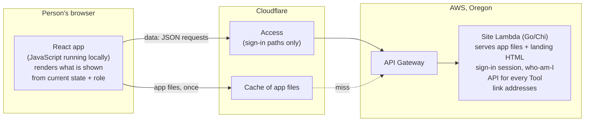
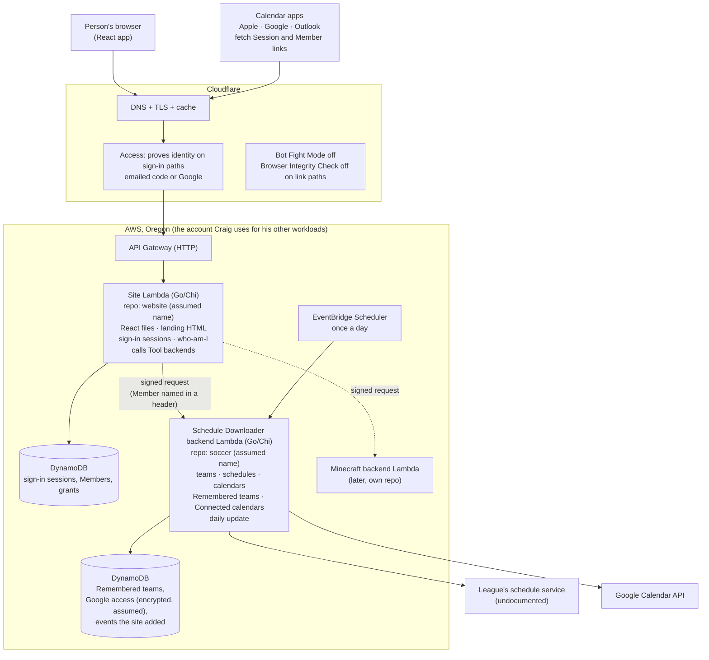
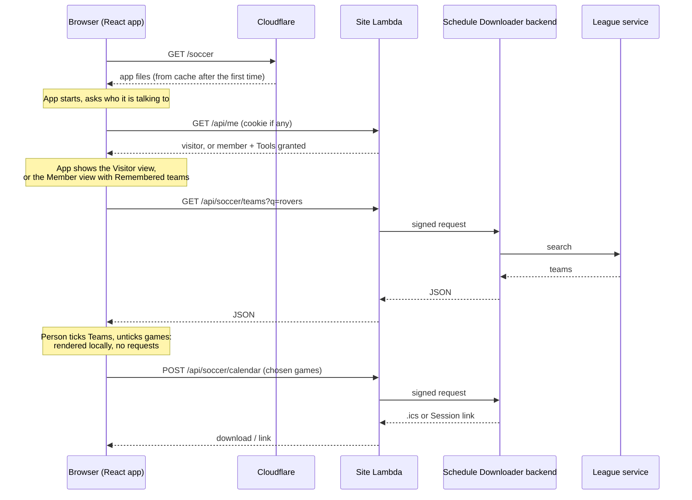

# How the site runs

Working sketch, drawn during the baseline discussion. Not a decision record.

## 1. Where the reactivity lives

"Static" describes how the files are delivered, not how the page behaves. The React app is a set of files that are the same for everyone (HTML, JavaScript, CSS). Once the browser has them, the JavaScript runs **in the browser**: ticking a Team, switching between Visitor and Member views, filtering games, all happen there instantly, with no server involved. The server is only called when the page needs data (search Teams, fetch a schedule, who am I) or something only the server may do (sign-in, build a calendar, write to Google).

Two consequences:

- The app files can be cached by Cloudflare, so the Site Lambda rarely serves them.
- The browser is never trusted. It *shows* Member sections because the server told it the role, but every Member action is checked again on the server using the Sign-in session cookie.

## 2. The whole picture

Every arrow into AWS is a short request that starts a Lambda and ends when the response is sent. The only work that is not a request is the daily update, which the scheduler starts. If the Access trial fails, Cognito takes Access's place; nothing else in the picture moves.

## 3. The soccer page, step by step

A Member's actions (save a Remembered team, connect Google) follow the same path; the Site Lambda refuses them without a valid Sign-in session, and the backend trusts the Member name only because only the Site can call it.

## 4. Lambda or a container

| | Lambda (chosen) | ECS Fargate container |
|---|---|---|
| Runs | per request, then stops | 24 hours a day |
| Cost at this traffic | about $0 (free tier covers it) | about $9 a month for the smallest task, plus about $16 for a load balancer or a few dollars for a public address |
| Idle | nothing to keep alive | process always up |
| Cold start | a few hundred ms for Go after a quiet spell | none |
| Fits | short requests, scheduled jobs | long-lived connections, long-running processes |

Nothing in the site needs a process that stays up. Highly interactive pages are not the deciding factor: the interaction happens in the browser either way. A container would start to make sense only for something like streaming a live Minecraft console over an open connection, and even then API Gateway's WebSocket mode is the serverless answer. The Minecraft Server itself runs on its own Machine and is outside this picture.
